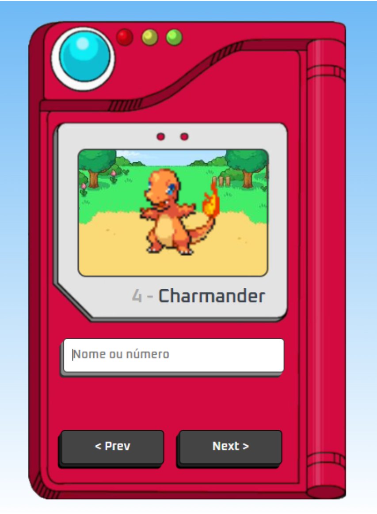

<h1 align="center"> Pokedex </h1>

  <a href="#-tecnologias">Tecnologias</a>&nbsp;&nbsp;&nbsp;|&nbsp;&nbsp;&nbsp;
  <a href="#-projeto">Projeto</a>&nbsp;&nbsp;&nbsp;|&nbsp;&nbsp;&nbsp;

  

  

## 🚀 Tecnologias

Esse projeto foi desenvolvido com as seguintes tecnologias:

- HTML e CSS
- JavaScript
- Git e Github
-Api (pokeapi)

## 💻 Projeto
este é um projeto que funciona como uma pokédex, ele exibe as seguintes informações sobre 650 Pokémons diferentes evoluções e personagens:

- Imagem
- Nome
- ID
  
Para a obter as informações de nome e tipo do Pokémon foi utilizada a API do "PokéAPI", já para a imagem de cada um foi utilizada a API do "[https://pokeres.bastionbot.org](https://pokeapi.co/)".

Cada Pokémon é exibido na tela do Mini gamer seguingo uma sequencia de evolução ae clicar no botão próximo. tambem e possivel fazer uma pesquisar pelo nome do pokemon (ex: pikachu) ou pedo ID do pokemon.

Preview do meu projeto <a href="https://steffanylivino.github.io/Pokedex/">Pokedex </a>

Feito com ♥ by Steffany Livino  
